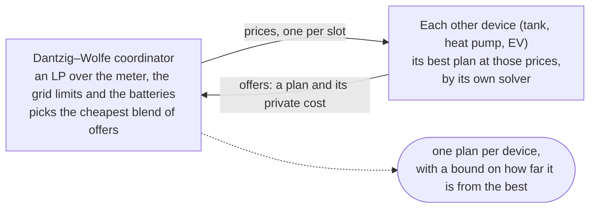
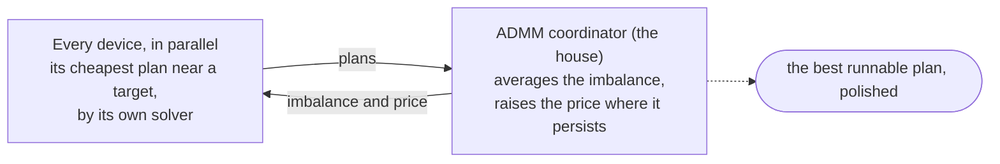

# home-energy-optimizer

**Makes a home's energy devices work together.**

A home's distributed energy resources (DERs) — a battery, an EV charger, a
hot-water tank, a heat pump, solar panels — often come from different makers,
and each optimises for itself. Planned one at a time they work against each
other: two batteries charge into the same solar surplus and import to do it;
the water heater runs from the grid while the battery could have covered it.

home-energy-optimizer lets them cooperate. Each device keeps its own model and
its own optimiser — a linear or quadratic programme, a dynamic programme, a
manufacturer's black box — and answers the same few questions through one
interface. A coordinator turns the answers into one plan for the whole house,
around solar output, tariffs and grid limits:

- **Dantzig–Wolfe**, the default, blends the devices' plans in a small linear
  programme and bounds how far the result can be from the best possible plan.
- **ADMM** steers the devices with one shared price, and needs no LP solver.

The house reaches a better outcome than its devices would alone, and the saving
is split among the solar and each device by what it contributed, so every
device is fairly rewarded for cooperating. No single solver is the point: each
device uses whichever answers its questions best. A dynamic programme, for
instance, suits a device with one state variable and also gives a policy for
every state; a linear programme solves a battery exactly.





It feeds [Home Assistant](https://www.home-assistant.io) and
[evcc](https://evcc.io). Try it in your browser:
[Smart Home Energy Optimizer](https://ameetdesh.github.io/multi_device_optimizer_standalone.html).
The theory, with the evidence behind every number, is in
[docs/theory.pdf](https://github.com/ameetdesh/home-energy-optimizer/blob/main/docs/theory.pdf). The Python package is
`home-energy-optimizer` (import `home_energy_optimizer`).

---

## Install

```bash
git clone https://github.com/ameetdesh/home-energy-optimizer && cd home-energy-optimizer
python3 -m venv .venv
.venv/bin/pip install -e .          # numpy only
```

`scipy` is needed only for the benchmarks in `bench/`:

```bash
.venv/bin/pip install -e ".[test]" scipy
.venv/bin/python -m pytest          # the full suite; a few reference checks skip without scipy or osqp
```

## Theory notes

[docs/theory.pdf](https://github.com/ameetdesh/home-energy-optimizer/blob/main/docs/theory.pdf) sets out the problem, the device interface
and both coordinators, with the evidence behind every number. It is built from
`docs/theory.tex`:

```bash
tools/build-theory          # -> docs/theory.pdf
tools/build-theory --figs   # regenerate docs/figs/ first (needs the bench extras)
```

It uses [tectonic](https://tectonic-typesetting.github.io) if installed (it
fetches missing LaTeX packages itself), else `latexmk`, else three `pdflatex`
passes.

The single-file browser pages rebuild with `admm/wasm/build.sh` and
`dw/wasm/build.sh`, which embed the Python with `tools/make_standalone.py` and,
if one has been built (`wasm/build_wheel.sh`, needs Docker), the compiled-kernel
wheel. The embedded Python is obfuscated; that is kept as a proof of concept,
since the source is here.

---

## Three ways to use it

### 1. As a library

Plan a site, then act between plans from the battery's own solver - here its
dynamic programme, whose value function answers "what now, from this state?"
without a re-solve. `plan()` (below) picks the coordinator.

```python
from home_energy_optimizer import (
    SiteConfig, BatteryConfig, Horizon, PolicySnapshot,
    coordinate, demo_forecasts, action, marginal_value, reservation_prices,
)

site = SiteConfig(horizon=Horizon(dt=0.25, hours=48.0),
                  battery=BatteryConfig(capacity_kwh=10.0),
                  water_heater=None, hvac=None)
fc   = demo_forecasts(site.horizon, tariff="dynamic")

# Slow tier: solve on the cadence forecasts actually change (15 min is fine)
result = coordinate(site, fc)
snap   = PolicySnapshot.from_result(site, fc, result)
snap.save("policy.npz")

# Fast tier: a process that never runs the solver
snap = PolicySnapshot.load("policy.npz")
t    = snap.step_for(hours_from_start=6.5)

action(snap, t, soe=4.2)                    # kW, + = charge
marginal_value(snap, t, soe=4.2)            # λ, currency/kWh
reservation_prices(snap, t, soe=4.2)        # {'import_below':…, 'export_above':…}
```

Safety limits are clamped **outside** the solver, never left to a penalty term:

```python
from home_energy_optimizer import clamp, HardLimits
safe, bound_by = clamp(action(snap, t, soe), other_load_kw=3.1,
                       limits=HardLimits(max_import_kw=17.25))
```

### 2. Local GUIs: ADMM or Dantzig–Wolfe

There are two testbed UIs, one per coordinator. They use different ports, so
both can run at once and be compared on the same settings.

| | ADMM coordinator, and the policy/evcc endpoints | Dantzig–Wolfe coordinator, with ADMM as an option (`dw/`) |
|---|---|---|
| start | `.venv/bin/python admm/gui/server.py` | `.venv/bin/python dw/gui/server.py` |
| opens | <http://127.0.0.1:8765> | <http://127.0.0.1:8766> |
| needs | numpy | numpy (the DW master uses the built-in solver in `src/home_energy_optimizer/dw/lpsolver.py`; scipy only for the optional HiGHS cross-check) |
| shows | ADMM iterations, λ, policy replay on hover | column-generation iterations, lower bound, meter price π, λ from the master |

```bash
# terminal 1 - ADMM
.venv/bin/python admm/gui/server.py       # http://127.0.0.1:8765

# terminal 2 - Dantzig-Wolfe
.venv/bin/python dw/gui/server.py         # http://127.0.0.1:8766
```

Both servers open a browser tab on start. Pass `--no-browser` to the DW server
(`dw/gui/server.py 8766 --no-browser`) to skip that, and a number to either
to change the port. Stop them with Ctrl-C. Both UIs accept deep links such as
`?n_batteries=2&max_import_kw=7&tariff=day_night`. The DW UI also accepts
`view=relaxed` or `view=<iteration>`. What the DW UI shows, and how to read
it, is in `dw/README.md`. In the DW UI (and its standalone page) the import
and export prices, the household load and the hot-water draw can be edited:
drag the hourly dots (on the bold lines) on the Prices and Power charts, and it
re-solves on release. The draw is the heat taken from the tank, in kW. Export is kept at
or below import; **reset** (or a new tariff or horizon) restores the preset.
The room's comfort band is edited the same way on the Room chart: one
low and one high dot per hour, flat 22–26 °C until dragged, with its own
**reset** under Advanced (a new horizon restores it too).
The same page can plan with **ADMM** instead (Method), with a slider for its
tether ρ, an "Adapt ρ" switch, each battery's step (its DP or its exact LP) and
a cold or warm start, so the two can be compared on one site.
While a solve runs, the runnable plan, lower bound and gap update after every
iteration (ADMM has no bound). With **Batteries in LP** off, DW keeps every
plan and smooths prices harder ("auto" pool and smoothing), which closes the
gap several times faster (`bench/dw_accel.py`).

The rest of this section describes the ADMM UI.

Sliders for capacity, power, efficiency, solar, horizon, number of batteries
(1–3) and grid import/export limits; toggles for each device and for PV
curtailment. Charts for prices with the no-trade band shaded, battery state of
energy, power flows and thermal state.

Hovering the battery chart replays the optimal policy from whatever state the
cursor is over, with **no re-solve** — the value function used directly.
Clicking prices a forced action against the optimum.

**One battery, slow and fast.** `battery/` is a third, smaller page: a single
battery's DP, with its policy drawn as a flow field over hour and state of
charge. The slow tier (the full solve) and the fast tier (one decision from any
state, read from the stored value function) are timed side by side. Hover to
replay the policy from the pointer.

```bash
.venv/bin/python battery/gui/server.py    # http://127.0.0.1:8768
battery/wasm/build.sh                     # or as one self-contained page
```

`battery/README.md` has the build steps and what each part of the page shows.

### 3. Home Assistant

Publishes the plan and the price signals as HA sensors. Walkthrough below. To
plan a real house's devices instead of publishing a simulated one, the
EMHASS adapter — **EMHASS: a whole house, two solvers at once**,
below — coordinates EMHASS's own solver and this package's, device by device.

### Which coordinator plans

```python
from home_energy_optimizer import plan
res = plan(site, fc)                  # Dantzig-Wolfe (default)
res = plan(site, fc, method="admm")   # ADMM (proximal message passing)
res.gap, res.lower_bound              # DW only: the plan is within `gap` of the best
res.meter_price                       # DW only: cost of one more kWh at the meter, per slot
```

Both return the same `CoordinationResult`, so `PolicySnapshot`, Home Assistant
and evcc work unchanged. DW puts plain batteries (and a modulating tank) into a
small LP and lets everything else (on/off tank, HVAC, EVs with a charger
minimum or a SoC goal) bid plans from its own DP. If DW cannot run (an export
price above the import price in some slot), `plan()` falls back to ADMM and
says why in `res.note`. `docs/theory.tex` explains both - the device interface
they share (section 2), each coordinator as a problem and an algorithm (sections
3-4) - and compares them (section 8); `bench/run_planners.py` reproduces the
comparison.

---

## Home Assistant, from scratch

The two scripts below talk to Home Assistant over its websocket API, which
needs one dependency beyond the core install:

```bash
.venv/bin/pip install -e ".[ha]"    # adds websockets
```

### Step 1 — run Home Assistant

```bash
docker run -d --name ha -p 8123:8123 -v "$PWD/ha-config:/config" \
    -e TZ=UTC homeassistant/home-assistant:stable
```

Give it a minute, then open <http://localhost:8123>.

### Step 2 — create an account

Complete the onboarding wizard: create a user, set a location, skip device
discovery. Any username and password will do for a local trial.

### Step 3 — get a long-lived access token

In Home Assistant: click your **user avatar** (bottom left) → **Security** tab →
scroll to **Long-lived access tokens** → **Create token**. Copy it; it is shown
only once.

### Step 4 — create the dashboard

```bash
HA_TOKEN=<your token> .venv/bin/python tools/ha-lambda-demo/setup_dashboard.py
# -> dashboard ready at http://127.0.0.1:8123/home-energy-optimizer
```

Doing this explicitly matters: entities published through the REST API are
*orphan states* with no entity-registry entry, and Home Assistant's
auto-generated Overview dashboard may not list them. The script creates a
dashboard with three views — Trade, Power flows, Thermal — over the websocket
API.

### Step 5 — stream data into it

```bash
HA_TOKEN=<your token> .venv/bin/python tools/ha-lambda-demo/run.py --speed 2
```

The slow tier plans with Dantzig–Wolfe; add `--method admm` for ADMM (each re-solve starts from the last one's state).
`--speed 2` runs a simulated day in about 12 real minutes, slow enough for the
history graphs to draw curves. `--speed 400` is a day in 4 seconds, useful as a
smoke test. Then open <http://localhost:8123/home-energy-optimizer>.

### What lands in Home Assistant

| entity | meaning |
|---|---|
| `sensor.hems_import_below` | import while the grid price is below this (from the battery's DP) |
| `sensor.hems_export_above` | export while the grid price is above this (from the battery's DP) |
| `sensor.hems_lambda` | λ, the value of a stored kWh, with a `forecast` array |
| `sensor.hems_worth_running` | run a flexible load while its value/kWh exceeds this |
| `sensor.hems_battery_action` | battery setpoint now (kW, + = charge) |
| `sensor.hems_battery_soe` | battery state of energy (kWh, plus `soc_percent`) |
| `sensor.hems_import_price` | the prevailing tariff |
| `sensor.hems_meter_price` | DW: the plan's cost of one more kWh at the meter, whole house (with `forecast`) |
| `sensor.hems_plan_gap` | DW: the plan is at most this far from the best possible; `unknown` under ADMM |
| `sensor.hems_pv`, `_load`, `_net_grid` | power flows (kW) |
| `sensor.hems_water_heater_temp`, `_power` | tank temperature and heater draw |
| `sensor.hems_hvac_temp`, `_power` | room temperature and HVAC draw |
| `sensor.hems_outdoor_temp` | outdoor temperature |

### Using it in an automation

A load worth about 0.25/kWh to run:

```yaml
automation:
  - alias: Run the dryer when energy is cheap enough
    trigger:
      - platform: state
        entity_id: sensor.hems_worth_running
    condition:
      - condition: numeric_state
        entity_id: sensor.hems_worth_running
        below: 0.25          # a kWh currently costs less than it is worth to us
    action:
      - service: switch.turn_on
        target:
          entity_id: switch.tumble_dryer
```

The dryer is **modelled nowhere in the optimiser** — it just reads a price. That
is the point: adding devices does not grow the optimisation.

For a battery you control directly, gate on the band instead:

```yaml
      - condition: template
        value_template: >
          {{ states('sensor.hems_import_price')|float
             < states('sensor.hems_import_below')|float }}
```

### Charting the forecast

`sensor.hems_lambda` carries a `forecast` attribute, so ApexCharts works:

```yaml
type: custom:apexcharts-card
header: {show: true, title: Marginal value of stored energy}
series:
  - entity: sensor.hems_lambda
    data_generator: |
      return entity.attributes.forecast.map(p =>
        [Date.now() + p.hours_ahead * 3600000, p.lambda]);
```

### Caveats for the Home Assistant path

- The demo uses synthetic forecasts. Point it at real data with
  `home_energy_optimizer.feeds` (keyless Open-Meteo PV, CSV, or a list from any tariff
  integration).
- States are pushed over the REST API, so they disappear when Home Assistant
  restarts. A durable deployment wants MQTT discovery or a custom component.

---

## EMHASS: a whole house, two solvers at once

The Home Assistant walkthrough above streams a *simulated* day into HA. This is
the other direction: [EMHASS](https://emhass.readthedocs.io) is a Home Assistant
add-on that already pulls live PV, load, prices and battery SoC out of HA, so the
adapter in `src/home_energy_optimizer/integrations/emhass.py` plans those real
inputs. It replaces EMHASS's single whole-house MILP with **one subproblem per
device**, coordinated by Dantzig–Wolfe at the meter.

The point is that each device keeps its own model and its own solver. A
deferrable load stays with EMHASS's MILP, which is good at it. A hot water tank
or a heat pump goes to this package's dynamic programme, which prices comfort and
returns a value function rather than one trajectory. The coordinator only makes
the plans agree on the meter, and reports what each device is worth.

> **Status.** The EMHASS side is a draft PR —
> [davidusb-geek/emhass#1158](https://github.com/davidusb-geek/emhass/pull/1158)
> — which adds the `optimization_backend` dispatch and the `participants` option.
> Released EMHASS has no `optimization_backend` key, so on stock EMHASS this
> config does nothing. The adapter in this package is complete and tested
> (`tests/test_emhass_adapter.py`); it imports EMHASS only when it plans, so it
> costs nothing if you never use it.

**To run it** next to your own Home Assistant, `tools/emhass-coordination/`
builds EMHASS from that branch with this package, starts it in Docker, plans,
and publishes to Home Assistant: a battery planned here, two deferrable loads
planned by EMHASS, and each one's share of the saving as a sensor.

```bash
HA_TOKEN=<token> python tools/emhass-coordination/coordinate.py up
HA_TOKEN=<token> python tools/emhass-coordination/coordinate.py run --every 30
```

Its README walks through each step, and where EMHASS's configuration is changed.

### A four-DER house

Solar, a battery, two deferrable loads, a hot water tank and a heat pump — split
across both solvers. Add to EMHASS's configuration:

```json
{
  "optimization_backend": "dantzig_wolfe",
  "costfun": "profit",

  "set_use_battery": true,
  "number_of_deferrable_loads": 2,
  "nominal_power_of_deferrable_loads": [2500, 1000],

  "participants": [
    {"devices": ["battery"], "solver": "emhass"},

    {"devices": ["deferrable0", "deferrable1"], "solver": "emhass"},

    {"devices": ["water_heater"], "solver": "home_energy_optimizer",
     "config": {"power_kw": 3.0, "liters": 180.0, "t_comfort": 55.0,
                "n_duty_levels": 2, "comfort_weight": 10.0}},

    {"devices": ["hvac"], "solver": "home_energy_optimizer",
     "config": {"power_kw": 1.5, "cop": 3.5, "c_room_kwh_per_k": 2.5,
                "r_wall_k_per_kw": 5.0,
                "t_comfort_low": 21.0, "t_comfort_high": 25.0}}
  ]
}
```

Keep whatever other EMHASS options those deferrable loads already use; they are
passed through to EMHASS's own model untouched. The battery is read from
EMHASS's `plant_conf` as it stands — capacity, the SoC window, both
efficiencies, both power limits and `battery_target_state_of_charge`.

| device | `solver` | planned by | in the coordination |
|---|---|---|---|
| solar | — | EMHASS's PV forecast | not a device; a player in the saving split |
| `battery` | `emhass` | EMHASS's linear battery model, held **exactly** in the master LP | continuous, no integers |
| `deferrable0`, `deferrable1` | `emhass` | EMHASS's own MILP, one solve per price query | bids plans |
| `water_heater` | `home_energy_optimizer` | this package's tank DP | bids on/off plans |
| `hvac` | `home_energy_optimizer` | this package's room DP | bids on/off plans |

The battery is held in the master LP only while EMHASS's battery is exactly its
linear constraints. `set_battery_dynamic`, a non-zero `weight_battery_charge` or
`weight_battery_discharge`, `battery_stress_cost`, `battery_soc_deficit_cost`,
`battery_soc_surplus_cost` or `battery_charge_power_derating` each take it out of
the master and make it a black-box participant instead — answered by EMHASS's own
model on every price query. That still plans; it is just slower. Move the battery
to `"solver": "home_energy_optimizer"` to have it planned by this package's DP
from the same `plant_conf` numbers, which gives a value function — λ at whatever
state the battery is in — rather than a plan with λ only along it.

Three details that are easy to get wrong:

- **One `config` per group.** A group's `config` is applied to every device in
  it, and the two thermal configs share field names (`power_kw`, `t_min`,
  `n_duty_levels`, …). Grouping `water_heater` and `hvac` together would give the
  heat pump the tank's `power_kw`. Give each its own participant, as above.
- **`water_heater` and `hvac` are not EMHASS loads.** They do not come from
  `number_of_deferrable_loads` and have no EMHASS entry; they exist only through
  a `home_energy_optimizer` participant, configured entirely by its `config`
  block. Devices this package knows: `battery`, `water_heater`, `hvac`.
- **Thermal devices need thermal forecasts.** The adapter reads
  `outdoor_temperature_forecast` (°C) and `hot_water_demand_kw` (kW) from
  EMHASS's input DataFrame, falling back to a flat 20 °C and no draw. Without
  them the tank and the heat pump plan against constants.

Any EMHASS device you leave out of `participants` becomes its own EMHASS group,
so a partial list is fine.

### What comes back

EMHASS's usual `opt_res` columns — `P_PV`, `P_Load`, `P_grid`, `P_deferrable0`,
`P_batt`, `SOC_opt`, `unit_load_cost`, `cost_fun_profit` — in EMHASS's own units,
so existing automations and charts keep working. Plus:

| column | meaning |
|---|---|
| `P_water_heater`, `temp_water_heater` | the tank's power (W) and temperature (°C) |
| `P_hvac`, `temp_hvac` | the heat pump's power (W) and room temperature (°C) |
| `fed_meter_price` | the cost of one more kWh at the meter, per slot — the master's dual |
| `fed_lower_bound`, `fed_gap` | how far this plan can be, at most, from the best possible one |
| `fed_share_<player>` | each player's share of the saving over the horizon, in currency |

The shares are the part no single MILP can give you: `fed_share_solar`,
`fed_share_battery`, `fed_share_water_heater`, `fed_share_hvac` and
`fed_share_deferrable0+deferrable1` (a group is one player, named by its
devices). Each device is first reimbursed what coordination cost it privately,
then the surplus is split — an Owen value between solar and the devices,
Aumann–Shapley among the devices — so the shares and reimbursements add up to the
saving exactly. `src/home_energy_optimizer/dw/attribution.py` has the derivation.

### When it declines

A home automation loop must always get a plan, so the adapter returns `None` and
lets EMHASS run its default solver — logging the option responsible — rather
than raising. `unsupported()` lists the cases: a `costfun` other than `profit` or
`cost`, `set_total_pv_sell`, `set_nocharge_from_grid` with a battery,
`set_battery_first_priority`, a hybrid inverter, more than one battery,
`heat_topology`, shared thermal tanks, deferrable load groups,
`cost_forecast_per_deferrable_load`, `set_deferrable_startup_penalty`,
`deferrable_load_max_cost`, capacity charges, and the `soc_target` family of
runtime arguments. An export price above the import price in some slot, or a
coordinator failure, falls back the same way.

---

## Prices from a battery's dynamic programme

A convenience of one device solver, not the heart of the method. When the
battery is solved by a dynamic programme, its value function gives three prices
at whatever state the battery is in, which the Home Assistant path publishes
between plans (a battery solved as an LP gives its plan, and λ only along it).
They are easy to conflate, and not interchangeable.

| | formula | answers |
|---|---|---|
| **λ** `marginal_value` | ∂V/∂s | what a kWh *inside a battery* is worth. One per battery |
| **reservation prices** `reservation_prices` | `λ·η_c` / `λ/η_d` | the grid prices at which importing or exporting starts to pay |
| **meter price** `meter_price` | `min(buy, λ/η_d, sell if surplus)` | what one more kWh *of consumption* costs |

Use the **reservation band** for trading decisions and the **meter price** for
whether to run a load. The band's width is exactly the round-trip loss, so it is
a genuine no-trade region: inside it, holding beats both directions.

Compare the band against the price actually faced — the import tariff while
importing, the export price while exporting. A discharge that displaces
household load realises the *import* price, not the export price.

---

## Also supported

**evcc.** `src/home_energy_optimizer/evcc.py` implements the optimizer HTTP contract used
by [evcc](https://evcc.io) (`POST /optimize/charge-schedule`), so a local server
can serve its `OPTIMIZER_URI` endpoint. Handles multiple batteries, loadpoints
modelled as charge-only batteries, per-slot charge demands and state-of-charge
goals, and a charger's minimum power as a semi-continuous floor. `docs/PLAN.md`
lists what is and is not mapped. Requests are planned with Dantzig–Wolfe: an
EV bids charging plans from its DP, evcc's grid limits are enforced in the
plan, and the response carries an extra `_hems_policy_certificate`. Start the
server with `HEMS_METHOD=admm` for ADMM.

**Real forecasts.** `home_energy_optimizer.feeds` provides keyless Open-Meteo PV and
temperature, CSV and list ingestion, and measured-value blending — anchoring the
first forecast slot to what was just measured and decaying back over four slots.

---

## Layout

```
src/home_energy_optimizer/     the package (import home_energy_optimizer)
  types.py         config + result dataclasses
  dp_battery.py    battery DP; returns the value function and policy
  dp_thermal.py    hot-water and HVAC DPs, and their thermostat baselines
  coordinate.py    plan scoring shared by both coordinators; coordinate() runs ADMM
  planner.py       plan(): Dantzig-Wolfe (default) or ADMM, one result type
  policy.py        value function -> actions, prices, counterfactuals
  feeds.py         real forecast inputs
  ha.py            Home Assistant publishing
  integrations/    emhass.py: EMHASS's devices as coordinated participants
  battery/         webapi.py: the single-battery page's backend
  evcc.py          evcc optimizer wire contract
  profiles.py      synthetic forecasts for tests and demos
  dw/              Dantzig-Wolfe: coordinator, LP solver, integrate (to HA and evcc),
                   attribution (who saves what), webapi (the DW app's backend)
  admm/            ADMM: coordinator, battery_qp (exact LP battery step),
                   webapi (the ADMM app's backend and the policy API)
dw/                the DW app: gui/ (server + page), wasm/ (single-file page), design notes
battery/           the single-battery page: one DP, its slow and fast tiers, the policy as a flow field
admm/              the ADMM app: gui/ (server + page; also the evcc endpoint), wasm/
wasm/              shared browser-build tooling: the compiled-kernel wheel, keep_names.py
bench/             exact references (continuous LP, joint DP, MILP, duals) and studies
tools/             theory build, page builder, HA dashboard setup, evcc checks
docs/theory.tex    theory notes (tools/build-theory makes the PDF)
docs/NOTES.md      measured findings
docs/PLAN.md       state and next steps
```

---

## Evidence

All measured; each number and the script behind it is in
[docs/theory.pdf](https://github.com/ameetdesh/home-energy-optimizer/blob/main/docs/theory.pdf), Appendix C.

**Cooperation pays.** For a battery and an on/off water heater over a day,
against an exact MILP of the same model (our own formulation, solved with
HiGHS), Dantzig–Wolfe captures 98.7–99.4% of the available savings in 0.6–0.7 s
and ADMM 97.3–99.1% in 4–8 s. On the Home Assistant demo site (battery, water
heater, HVAC) Dantzig–Wolfe captures 98–99% and ADMM 97–98%, and every
Dantzig–Wolfe plan carries its certified gap.

**Grid limits hold.** Dantzig–Wolfe meets a limit exactly or prices and reports
the breach; ADMM left at most 5 W over on 72 test sites.

**The split is fair.** Against the Shapley value, which needs a plan for every
coalition, the savings split came within 0.46 (within 0.13 for the batteries)
on six test cases, from one extra plan.

**The device solvers are accurate.** A battery's dynamic programme captures
98.4–99.2% of what its exact LP does; its λ lies within 0.007–0.032/kWh of the
LP's dual, and is published with a ±0.04/kWh band.

---

## Licence

MIT; see [LICENSE](https://github.com/ameetdesh/home-energy-optimizer/blob/main/LICENSE).
